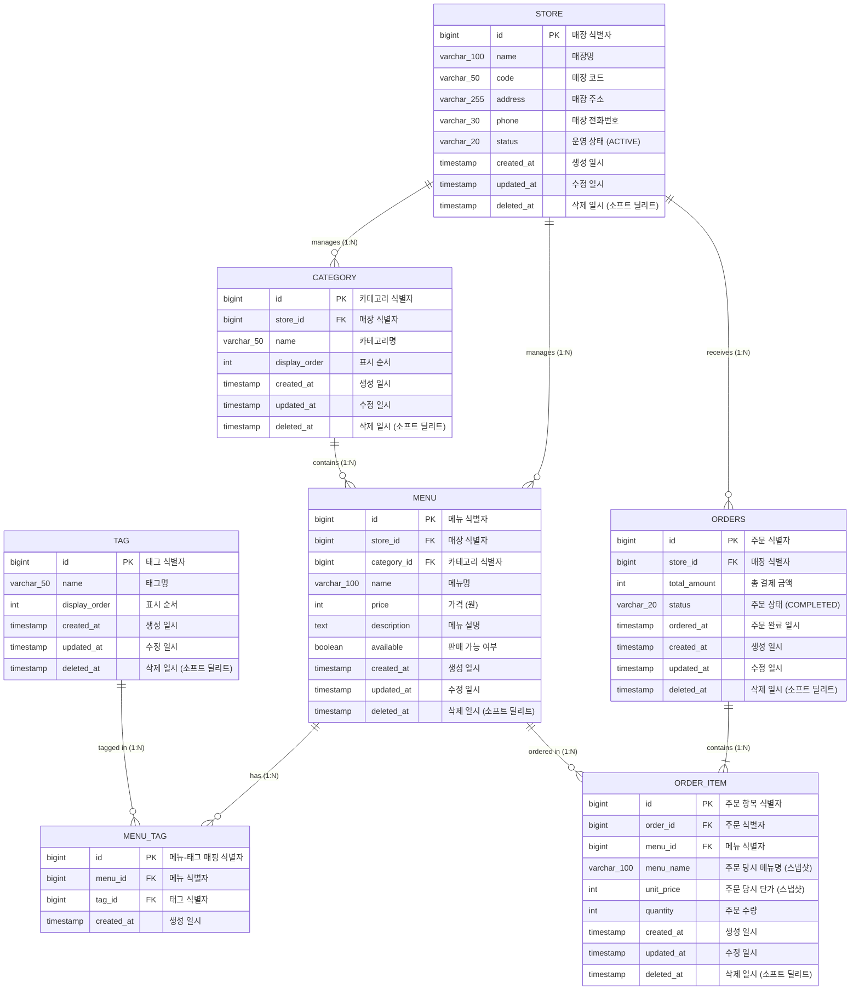

# ERD 및 데이터베이스 스키마 명세서 (Database Schema Specification)

## 1. 개요 및 목적

본 문서는 **AI 키오스크 기반 스마트 주문 및 관리 시스템**의 데이터베이스 개체 관계 도면(Entity Relationship Diagram, ERD) 및 데이터베이스 스키마 상세 명세를 정의함.

본 문서는 `docs/functional-requirements.md`(기능 요구사항) 및 `docs/use-cases.md`(유즈케이스 명세서)의 비즈니스 규칙을 기반으로 작성되었으며, **매장(Store)** 다점포 지원과 N:M 정규화된 **태그(Tag)** 구조를 포함하여 Spring Data JPA 엔티티 설계, DDL 작성, QueryDSL 쿼리 작성 및 데이터베이스 복합 인덱스 설계의 기준 문서로 활용됨.

---

## 2. ERD 다이어그램 (Mermaid)



---

## 3. 엔티티 및 테이블 상세 명세

### 3.1 `store` (매장 테이블)
키오스크 및 주문이 운영되는 매장 정보를 정의함.

| 컬럼명 | 데이터 타입 | Nullable | Primary/Foreign Key | Default / Check | 설명 | 관련 요구사항 |
| --- | --- | --- | --- | --- | --- | --- |
| `id` | BIGINT | NOT NULL | PK | AUTO_INCREMENT | 매장 고유 식별자 | FR-C01, FR-A01 |
| `name` | VARCHAR(100) | NOT NULL | - | - | 매장명 (예: 강남점, 홍대점) | FR-A01 |
| `code` | VARCHAR(50) | NOT NULL | UNIQUE | - | 매장 고유 코드 (예: STORE-001) | FR-A01 |
| `address` | VARCHAR(255) | NULL | - | - | 매장 주소 | FR-A01 |
| `phone` | VARCHAR(30) | NULL | - | - | 매장 전화번호 | FR-A01 |
| `status` | VARCHAR(20) | NOT NULL | - | DEFAULT 'ACTIVE' | 매장 운영 상태 (`ACTIVE`, `INACTIVE`) | FR-A01 |
| `created_at` | TIMESTAMP | NOT NULL | - | CURRENT_TIMESTAMP | 레코드 생성 일시 | - |
| `updated_at` | TIMESTAMP | NOT NULL | - | CURRENT_TIMESTAMP | 레코드 수정 일시 | - |
| `deleted_at` | TIMESTAMP | NULL | - | NULL | 삭제 일시 (소프트 딜리트) | FR-A01-3 |

---

### 3.2 `category` (카테고리 테이블)
매장별 메뉴를 분류하기 위한 카테고리 정보 엔티티임.

| 컬럼명 | 데이터 타입 | Nullable | Primary/Foreign Key | Default / Check | 설명 | 관련 요구사항 |
| --- | --- | --- | --- | --- | --- | --- |
| `id` | BIGINT | NOT NULL | PK | AUTO_INCREMENT | 카테고리 고유 식별자 | FR-C01, FR-A01 |
| `store_id` | BIGINT | NOT NULL | FK (`store.id`) | - | 소속 매장 식별자 | FR-C01, FR-A01 |
| `name` | VARCHAR(50) | NOT NULL | - | - | 카테고리명 (예: 메인요리, 음료 등) | FR-C01-2 |
| `display_order` | INT | NOT NULL | - | DEFAULT 0 | 화면 노출 정렬 순서 | FR-C01-1 |
| `created_at` | TIMESTAMP | NOT NULL | - | CURRENT_TIMESTAMP | 레코드 생성 일시 | - |
| `updated_at` | TIMESTAMP | NOT NULL | - | CURRENT_TIMESTAMP | 레코드 수정 일시 | - |
| `deleted_at` | TIMESTAMP | NULL | - | NULL | 삭제 일시 (소프트 딜리트) | FR-A01-3 |

---

### 3.3 `menu` (메뉴 테이블)
매장에 등록되어 고객이 주문하거나 관리자가 CRUD하는 메뉴 엔티티임.

| 컬럼명 | 데이터 타입 | Nullable | Primary/Foreign Key | Default / Check | 설명 | 관련 요구사항 |
| --- | --- | --- | --- | --- | --- | --- |
| `id` | BIGINT | NOT NULL | PK | AUTO_INCREMENT | 메뉴 고유 식별자 | FR-C01, FR-A01 |
| `store_id` | BIGINT | NOT NULL | FK (`store.id`) | - | 소속 매장 식별자 | FR-C01, FR-A01 |
| `category_id` | BIGINT | NOT NULL | FK (`category.id`) | - | 소속 카테고리 식별자 | FR-C01-2, FR-A01-1 |
| `name` | VARCHAR(100) | NOT NULL | - | - | 메뉴명 | FR-A01-1, FR-A02-1 |
| `price` | INT | NOT NULL | - | CHECK (`price` >= 0) | 메뉴 가격 (원) | FR-A01-1, FR-A02-1 |
| `description` | TEXT | NULL | - | - | 메뉴 상세 설명 | FR-A01-1, FR-A02-1 |
| `available` | BOOLEAN | NOT NULL | - | DEFAULT TRUE | 판매 가능 여부 (TRUE: 판매중, FALSE: 품절) | FR-C01-1, FR-A01-2, FR-A02-1 |
| `created_at` | TIMESTAMP | NOT NULL | - | CURRENT_TIMESTAMP | 레코드 생성 일시 | - |
| `updated_at` | TIMESTAMP | NOT NULL | - | CURRENT_TIMESTAMP | 레코드 수정 일시 | - |
| `deleted_at` | TIMESTAMP | NULL | - | NULL | 삭제 일시 (소프트 딜리트) | FR-A01-3, FR-C01-1 |

---

### 3.4 `tag` (태그 테이블)
메뉴에 부여되는 속성/분류 태그 엔티티임. (정규화된 태그 마스터)

| 컬럼명 | 데이터 타입 | Nullable | Primary/Foreign Key | Default / Check | 설명 | 관련 요구사항 |
| --- | --- | --- | --- | --- | --- | --- |
| `id` | BIGINT | NOT NULL | PK | AUTO_INCREMENT | 태그 고유 식별자 | FR-A01-1, FR-A02-1 |
| `name` | VARCHAR(50) | NOT NULL | UNIQUE | - | 태그명 (예: 인기, 매콤, 추천, 베스트) | FR-A01-1 |
| `display_order` | INT | NOT NULL | - | DEFAULT 0 | 태그 정렬 순서 | FR-A01-1 |
| `created_at` | TIMESTAMP | NOT NULL | - | CURRENT_TIMESTAMP | 레코드 생성 일시 | - |
| `updated_at` | TIMESTAMP | NOT NULL | - | CURRENT_TIMESTAMP | 레코드 수정 일시 | - |
| `deleted_at` | TIMESTAMP | NULL | - | NULL | 삭제 일시 (소프트 딜리트) | FR-A01-3 |

---

### 3.5 `menu_tag` (메뉴-태그 매핑 테이블)
메뉴(`menu`)와 태그(`tag`) 간의 N:M 다대다 관계를 매핑하는 교차 엔티티임.

| 컬럼명 | 데이터 타입 | Nullable | Primary/Foreign Key | Default / Check | 설명 | 관련 요구사항 |
| --- | --- | --- | --- | --- | --- | --- |
| `id` | BIGINT | NOT NULL | PK | AUTO_INCREMENT | 매핑 고유 식별자 | FR-A01-1, FR-A02-1 |
| `menu_id` | BIGINT | NOT NULL | FK (`menu.id`) | - | 메뉴 식별자 | FR-A01-1 |
| `tag_id` | BIGINT | NOT NULL | FK (`tag.id`) | - | 태그 식별자 | FR-A01-1 |
| `created_at` | TIMESTAMP | NOT NULL | - | CURRENT_TIMESTAMP | 레코드 매핑 일시 | - |

---

### 3.6 `orders` (주문 헤더 테이블)
특정 매장에서 결제 완료된 주문 헤더 엔티티임.

| 컬럼명 | 데이터 타입 | Nullable | Primary/Foreign Key | Default / Check | 설명 | 관련 요구사항 |
| --- | --- | --- | --- | --- | --- | --- |
| `id` | BIGINT | NOT NULL | PK | AUTO_INCREMENT | 주문 고유 식별자 | FR-C04 |
| `store_id` | BIGINT | NOT NULL | FK (`store.id`) | - | 주문이 발생한 매장 식별자 | FR-C04, FR-A03 |
| `total_amount` | INT | NOT NULL | - | CHECK (`total_amount` >= 0) | 주문 총 결제 금액 | FR-C03-2, FR-C04-2 |
| `status` | VARCHAR(20) | NOT NULL | - | DEFAULT 'COMPLETED' | 주문 상태 (`COMPLETED`) | FR-C04-2, FR-A03-2 |
| `ordered_at` | TIMESTAMP | NOT NULL | - | CURRENT_TIMESTAMP | 주문 완료 처리 일시 | FR-A03-1 |
| `created_at` | TIMESTAMP | NOT NULL | - | CURRENT_TIMESTAMP | 레코드 생성 일시 | - |
| `updated_at` | TIMESTAMP | NOT NULL | - | CURRENT_TIMESTAMP | 레코드 수정 일시 | - |
| `deleted_at` | TIMESTAMP | NULL | - | NULL | 삭제 일시 (소프트 딜리트) | FR-A01-3 |

---

### 3.7 `order_item` (주문 항목 스냅샷 테이블)
주문에 포함된 개별 메뉴 항목과 주문 당시의 스냅샷 정보 엔티티임.

| 컬럼명 | 데이터 타입 | Nullable | Primary/Foreign Key | Default / Check | 설명 | 관련 요구사항 |
| --- | --- | --- | --- | --- | --- | --- |
| `id` | BIGINT | NOT NULL | PK | AUTO_INCREMENT | 주문 항목 고유 식별자 | FR-C04 |
| `order_id` | BIGINT | NOT NULL | FK (`orders.id`) | - | 소속 주문 식별자 | FR-C04-2 |
| `menu_id` | BIGINT | NOT NULL | FK (`menu.id`) | - | 주문 당시 메뉴 식별자 | FR-C04-2 |
| `menu_name` | VARCHAR(100) | NOT NULL | - | - | 주문 당시 메뉴명 (스냅샷) | FR-C04-2, FR-A01-4 |
| `unit_price` | INT | NOT NULL | - | CHECK (`unit_price` >= 0) | 주문 당시 단가 (스냅샷) | FR-C04-2, FR-A01-4, FR-A03-2 |
| `quantity` | INT | NOT NULL | - | CHECK (`quantity` > 0) | 주문 수량 | FR-C04-2, FR-A03-3 |
| `created_at` | TIMESTAMP | NOT NULL | - | CURRENT_TIMESTAMP | 레코드 생성 일시 | - |
| `updated_at` | TIMESTAMP | NOT NULL | - | CURRENT_TIMESTAMP | 레코드 수정 일시 | - |
| `deleted_at` | TIMESTAMP | NULL | - | NULL | 삭제 일시 (소프트 딜리트) | FR-A01-3 |

---

## 4. 데이터베이스 핵심 설계 정책 및 인덱스 전략

### 4.1 소프트 딜리트 (Soft Delete) 정책
- 모든 테이블(`store`, `category`, `menu`, `tag`, `orders`, `order_item`)에 `deleted_at` (TIMESTAMP) 컬럼을 추가함.
- 데이터 삭제 시 `DELETE` 쿼리 대신 `UPDATE ... SET deleted_at = NOW()`를 수행함.
- 모든 비즈니스 조회의 default filter는 `WHERE deleted_at IS NULL` 조건을 적용함.

### 4.2 주문 단가 및 메뉴명 스냅샷 (Snapshot) 패턴
- `order_item` 테이블에는 `menu_id` 뿐만 아니라 주문 당시의 `menu_name`과 `unit_price` 필드를 복사 보존함.
- 관리자가 추후 메뉴 가격을 인상/인하하거나 메뉴명을 수정하거나 소프트 딜리트 처리하더라도, 과거에 발생한 매출 통계(`FR-A03`) 및 영수증/주문 이력의 데이터 정합성이 유지됨.

### 4.3 정규화된 태그 (Tag N:M) 패턴
- 기존 단일 `VARCHAR` 쉼표 구분 문자열 방식에서 `tag` 및 `menu_tag` 교차 테이블로 분리 정규화함에 따라 태그별 메뉴 검색(`FR-A02`), 인기 태그 통계 확장성이 향상됨.

### 4.4 데이터베이스 인덱스 (Indexing Strategy)
대용량 데이터 조회 및 통계 집계 성능을 최적화하기 위해 다음 인덱스를 생성함.

1. **`idx_store_status_deleted`**
   - **대상 테이블**: `store`
   - **컬럼**: `(status, deleted_at)`
   - **용도**: 활성 매장 목록 조회 성능 최적화.

2. **`idx_category_store_deleted`**
   - **대상 테이블**: `category`
   - **컬럼**: `(store_id, deleted_at)`
   - **용도**: 특정 매장의 카테고리 목록 조회 속도 최적화.

3. **`idx_menu_store_category_available_deleted`**
   - **대상 테이블**: `menu`
   - **컬럼**: `(store_id, category_id, available, deleted_at)`
   - **용도**: 매장별 카테고리 메뉴 목록 조회 (`FR-C01`) 및 관리자 QueryDSL 동적 검색 (`FR-A02`) 복합 검색 성능 최적화.

4. **`idx_menu_tag_menu_id` / `idx_menu_tag_tag_id`**
   - **대상 테이블**: `menu_tag`
   - **컬럼**: `(menu_id)`, `(tag_id)`
   - **용도**: 메뉴별 태그 조회 및 특정 태그 기반 메뉴 필터링 조인 속도 보장.

5. **`idx_orders_store_status_ordered_at`**
   - **대상 테이블**: `orders`
   - **컬럼**: `(store_id, status, ordered_at)`
   - **용도**: 매장별 기간 매출/판매 수량 통계 집계 (`FR-A03`, `UC-A05`) 시 범위 검색(`BETWEEN`) 속도 최적화.

6. **`idx_order_item_order_id` / `idx_order_item_menu_id`**
   - **대상 테이블**: `order_item`
   - **컬럼**: `(order_id)`, `(menu_id)`
   - **용도**: 주문 내역 조인 및 인기 메뉴 Top 5 집계 (`GROUP BY menu_id`) 쿼리 성능 최적화.

---

## 5. DDL 스크립트 (PostgreSQL / ANSI SQL)

```sql
-- 1. 매장 테이블 생성
CREATE TABLE store (
    id BIGSERIAL PRIMARY KEY,
    name VARCHAR(100) NOT NULL,
    code VARCHAR(50) NOT NULL UNIQUE,
    address VARCHAR(255) NULL,
    phone VARCHAR(30) NULL,
    status VARCHAR(20) NOT NULL DEFAULT 'ACTIVE',
    created_at TIMESTAMP NOT NULL DEFAULT CURRENT_TIMESTAMP,
    updated_at TIMESTAMP NOT NULL DEFAULT CURRENT_TIMESTAMP,
    deleted_at TIMESTAMP NULL
);

-- 2. 카테고리 테이블 생성
CREATE TABLE category (
    id BIGSERIAL PRIMARY KEY,
    store_id BIGINT NOT NULL,
    name VARCHAR(50) NOT NULL,
    display_order INT NOT NULL DEFAULT 0,
    created_at TIMESTAMP NOT NULL DEFAULT CURRENT_TIMESTAMP,
    updated_at TIMESTAMP NOT NULL DEFAULT CURRENT_TIMESTAMP,
    deleted_at TIMESTAMP NULL,
    CONSTRAINT fk_category_store FOREIGN KEY (store_id) REFERENCES store(id)
);

-- 3. 메뉴 테이블 생성
CREATE TABLE menu (
    id BIGSERIAL PRIMARY KEY,
    store_id BIGINT NOT NULL,
    category_id BIGINT NOT NULL,
    name VARCHAR(100) NOT NULL,
    price INT NOT NULL CHECK (price >= 0),
    description TEXT NULL,
    available BOOLEAN NOT NULL DEFAULT TRUE,
    created_at TIMESTAMP NOT NULL DEFAULT CURRENT_TIMESTAMP,
    updated_at TIMESTAMP NOT NULL DEFAULT CURRENT_TIMESTAMP,
    deleted_at TIMESTAMP NULL,
    CONSTRAINT fk_menu_store FOREIGN KEY (store_id) REFERENCES store(id),
    CONSTRAINT fk_menu_category FOREIGN KEY (category_id) REFERENCES category(id)
);

-- 4. 태그 테이블 생성
CREATE TABLE tag (
    id BIGSERIAL PRIMARY KEY,
    name VARCHAR(50) NOT NULL UNIQUE,
    display_order INT NOT NULL DEFAULT 0,
    created_at TIMESTAMP NOT NULL DEFAULT CURRENT_TIMESTAMP,
    updated_at TIMESTAMP NOT NULL DEFAULT CURRENT_TIMESTAMP,
    deleted_at TIMESTAMP NULL
);

-- 5. 메뉴-태그 매핑 테이블 생성
CREATE TABLE menu_tag (
    id BIGSERIAL PRIMARY KEY,
    menu_id BIGINT NOT NULL,
    tag_id BIGINT NOT NULL,
    created_at TIMESTAMP NOT NULL DEFAULT CURRENT_TIMESTAMP,
    CONSTRAINT fk_menu_tag_menu FOREIGN KEY (menu_id) REFERENCES menu(id),
    CONSTRAINT fk_menu_tag_tag FOREIGN KEY (tag_id) REFERENCES tag(id),
    CONSTRAINT uk_menu_tag UNIQUE (menu_id, tag_id)
);

-- 6. 주문 헤더 테이블 생성
CREATE TABLE orders (
    id BIGSERIAL PRIMARY KEY,
    store_id BIGINT NOT NULL,
    total_amount INT NOT NULL CHECK (total_amount >= 0),
    status VARCHAR(20) NOT NULL DEFAULT 'COMPLETED',
    ordered_at TIMESTAMP NOT NULL DEFAULT CURRENT_TIMESTAMP,
    created_at TIMESTAMP NOT NULL DEFAULT CURRENT_TIMESTAMP,
    updated_at TIMESTAMP NOT NULL DEFAULT CURRENT_TIMESTAMP,
    deleted_at TIMESTAMP NULL,
    CONSTRAINT fk_orders_store FOREIGN KEY (store_id) REFERENCES store(id)
);

-- 7. 주문 항목 테이블 생성
CREATE TABLE order_item (
    id BIGSERIAL PRIMARY KEY,
    order_id BIGINT NOT NULL,
    menu_id BIGINT NOT NULL,
    menu_name VARCHAR(100) NOT NULL,
    unit_price INT NOT NULL CHECK (unit_price >= 0),
    quantity INT NOT NULL CHECK (quantity > 0),
    created_at TIMESTAMP NOT NULL DEFAULT CURRENT_TIMESTAMP,
    updated_at TIMESTAMP NOT NULL DEFAULT CURRENT_TIMESTAMP,
    deleted_at TIMESTAMP NULL,
    CONSTRAINT fk_order_item_orders FOREIGN KEY (order_id) REFERENCES orders(id),
    CONSTRAINT fk_order_item_menu FOREIGN KEY (menu_id) REFERENCES menu(id)
);

-- 8. Performance Indexes
CREATE INDEX idx_store_status_deleted ON store (status, deleted_at);
CREATE INDEX idx_category_store_deleted ON category (store_id, deleted_at);
CREATE INDEX idx_menu_store_category_available_deleted ON menu (store_id, category_id, available, deleted_at);
CREATE INDEX idx_menu_tag_menu_id ON menu_tag (menu_id);
CREATE INDEX idx_menu_tag_tag_id ON menu_tag (tag_id);
CREATE INDEX idx_orders_store_status_ordered_at ON orders (store_id, status, ordered_at);
CREATE INDEX idx_order_item_order_id ON order_item (order_id);
CREATE INDEX idx_order_item_menu_id ON order_item (menu_id);
```

---

## 6. 추적성 매트릭스 (Traceability Matrix)

| 엔티티 (테이블명) | 주요 관련 필드 | 매핑 기능 요구사항 ID | 매핑 유즈케이스 ID | 비즈니스 목적 |
| --- | --- | --- | --- | --- |
| `store` | `name`, `code`, `status`, `deleted_at` | `FR-C01`, `FR-A01` | `UC-C01`, `UC-A01` | 매장별 키오스크 환경 및 다점포 관리 |
| `category` | `store_id`, `name`, `display_order` | `FR-C01`, `FR-A01` | `UC-C01`, `UC-A01` | 매장별 카테고리 탐색 및 분류 |
| `menu` | `store_id`, `category_id`, `name`, `price`, `available` | `FR-C01`, `FR-C02`, `FR-C04`, `FR-A01`, `FR-A02` | `UC-C01`, `UC-C02`, `UC-C04`, `UC-A01`, `UC-A02`, `UC-A03`, `UC-A04` | 매장별 메뉴 관리, 검증 및 QueryDSL 동적 검색 |
| `tag` / `menu_tag` | `name`, `menu_id`, `tag_id` | `FR-A01-1`, `FR-A02-1` | `UC-A01`, `UC-A04` | 메뉴 태그 마스터 및 다대다 매핑을 통한 키워드/태그 동적 필터링 |
| `orders` | `store_id`, `total_amount`, `status`, `ordered_at` | `FR-C04`, `FR-A03` | `UC-C04`, `UC-A05` | 매장별 주문 결제 기록 및 매출 통계 집계 기준 |
| `order_item` | `menu_name`, `unit_price`, `quantity` | `FR-C04-2`, `FR-A01-4`, `FR-A03-2` | `UC-C04`, `UC-A05` | 주문 시점 스냅샷 보존 및 기간별/매장별/카테고리별 매출 & 인기 메뉴 Top 5 통계 계산 |

---
