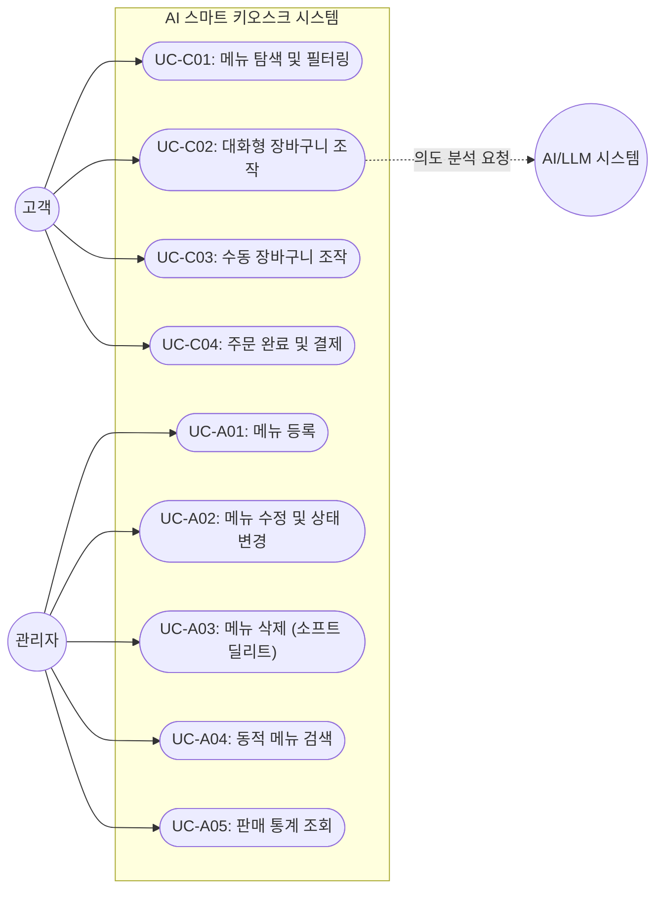

# 유즈케이스 명세서 (Use Case Specification)

## 1. 개요 및 목적

본 문서는 **AI 키오스크 기반 스마트 주문 및 관리 시스템(MVP)**의 주요 사용자(고객, 관리자)별 유즈케이스를 정의함. 
`docs/functional-requirements.md`의 기능 요구사항 분석 전, 사용자의 시나리오 및 시스템과의 상호작용 흐름(기본 흐름, 대안 흐름, 예외 흐름)을 구체화하여 요구사항의 완전성과 일관성을 검증하는 것을 목적으로 함.

---

## 2. 액터(Actor) 정의

| 액터명 | 액터 구분 | 설명 |
| --- | --- | --- |
| **고객 (Customer)** | 주 액터 (Primary) | 키오스크 화면에서 메뉴 탐색, 대화형/수동 장바구니 조작, 주문을 수행하는 사용자 |
| **관리자 (Admin)** | 주 액터 (Primary) | 관리자 콘솔에서 메뉴 CRUD, 복합 조건 검색, 판매 통계를 조회하는 사용자 |
| **AI/LLM 시스템** | 외부/보조 액터 (Supporting) | 고객의 자연어 입력을 분석하여 구조화된 장바구니 액션(JSON)을 추출해 주는 언어 모델 시스템 |

---

## 3. 유즈케이스 목록 및 다이어그램

### 3.1 유즈케이스 다이어그램 (Mermaid)

### 3.2 유즈케이스 요약표

| 유즈케이스 ID | 유즈케이스명 | 주 액터 | 핵심 요약 |
| --- | --- | --- | --- |
| **UC-C01** | 메뉴 탐색 및 필터링 | 고객 | 카테고리별로 판매 가능한 메뉴 목록을 조회함. |
| **UC-C02** | 대화형 장바구니 조작 | 고객 | 대화창에 자연어를 입력하여 장바구니 항목을 추가/삭제/수정함. |
| **UC-C03** | 수동 장바구니 조작 | 고객 | 화면 UI 버튼을 통해 장바구니 수량 변경 및 항목 삭제를 수행함. |
| **UC-C04** | 주문 완료 및 결제 | 고객 | 장바구니 내 항목으로 주문을 생성하고 결제를 완료함. |
| **UC-A01** | 메뉴 등록 | 관리자 | 신규 메뉴 정보를 입력하고 등록함. |
| **UC-A02** | 메뉴 수정 및 상태 변경 | 관리자 | 메뉴 기본 정보 및 판매 상태(판매중/품절)를 변경함. |
| **UC-A03** | 메뉴 삭제 (소프트 딜리트) | 관리자 | 메뉴를 소프트 딜리트(`deletedAt` 기록) 처리함. |
| **UC-A04** | 동적 메뉴 검색 | 관리자 | 키워드, 카테고리, 판매 여부, 가격대를 조합하여 동적 검색함. |
| **UC-A05** | 판매 통계 조회 | 관리자 | 기간, 카테고리, 가격 구간별 매출 및 인기 메뉴 Top 5를 확인함. |

---

## 4. 유즈케이스 상세 명세

---

### [UC-C01] 메뉴 탐색 및 필터링

* **주 액터**: 고객
* **선행 조건**: 시스템이 정상 동작 중이며 키오스크 메인 메뉴 화면이 표시되어 있어야 함.
* **후행 조건**: 고객이 선택한 카테고리에 해당하는 판매 가능한 메뉴 목록이 화면에 출력됨.

#### 기본 흐름 (Main Flow)
1. 고객이 메뉴 화면에 접근함.
2. 시스템은 판매 상태가 '판매중'(`available = true`)이고 삭제되지 않은(`deletedAt IS NULL`) 메뉴 목록을 카테고리별로 조회하여 출력함.
3. 고객이 특정 카테고리를 선택함.
4. 시스템은 해당 카테고리에 속한 메뉴만 필터링하여 화면에 표시함.

#### 대안 / 예외 흐름 (Alternative / Exception Flow)
* **[E1] 해당 카테고리에 메뉴가 없는 경우**
  1. 시스템은 "해당 카테고리에 등록된 메뉴가 없습니다." 안내 메시지를 출력함.
* **[A1] 품절/중지 처리된 메뉴**
  1. 판매중지(`available = false`) 상태거나 소프트 딜리트된 메뉴는 고객 목록 조회 대상에서 자동 제외됨.

---

### [UC-C02] 대화형 장바구니 조작

* **주 액터**: 고객, AI/LLM 시스템
* **선행 조건**: 고객이 대화 입력 창이 포함된 주문 화면에 진입해 있어야 함.
* **후행 조건**: 고객의 자연어 요청이 분석되어 장바구니가 업데이트되거나 사유 메시지가 대화창에 응답됨.

#### 기본 흐름 (Main Flow)
1. 고객이 대화 입력 창에 자연어 문장을 입력함. (예: "김치찌개 하나 담아주고 콜라는 빼줘")
2. 시스템은 현재 장바구니 상태, 판매 가능 메뉴 목록, 대화 맥락과 함께 LLM에 분석을 요청함.
3. LLM 시스템은 입력된 의도를 파싱하여 구조화된 액션(예: `ADD`, `REMOVE`, `CHANGE_QUANTITY`) JSON을 반환함.
4. 시스템은 반환된 액션 목록에 대해 메뉴 존재 여부 및 판매 가능 여부를 검증함.
5. 검증에 성공한 액션만 장바구니에 반영함.
6. 시스템은 반영 결과(예: "김치찌개 1개가 장바구니에 담겼고, 콜라가 제외되었습니다.")를 대화창에 응답함.

#### 대안 / 예외 흐름 (Alternative / Exception Flow)
* **[E1] LLM 호출 실패 또는 JSON 파싱 오류 발생 시**
  1. 시스템은 장바구니 상태를 변경하지 않고 유지함.
  2. 시스템은 대화창에 "죄송합니다. 요청을 이해하지 못했습니다. 다시 말씀해 주시거나 화면에서 직접 선택해 주세요."라고 안내함.
* **[E2] 존재하지 않거나 판매 중단된 메뉴 요청 시**
  1. 시스템은 해당 액션을 거부함.
  2. 시스템은 "현재 'XXX' 메뉴는 주문할 수 없습니다."라는 오류 사유를 대화 응답으로 안내하고 유효한 액션만 반영함.
* **[E3] 수량이 0 이하로 입력된 경우**
  1. 수량 변경 요청 시 수량이 0 이하가 되면 해당 항목을 장바구니에서 제거하거나 경고 안내를 보냄.

---

### [UC-C03] 수동 장바구니 조작

* **주 액터**: 고객
* **선행 조건**: 화면에 메뉴 목록 및 장바구니 영역이 표시되어 있어야 함.
* **후행 조건**: 장바구니의 항목, 수량, 총금액이 즉시 갱신됨.

#### 기본 흐름 (Main Flow)
1. 고객이 메뉴 카드의 [담기] 버튼을 누르거나, 장바구니 목록의 수량 조절(+, -) 버튼 / [삭제] 버튼을 클릭함.
2. 시스템은 해당 메뉴의 유효성(판매 상태 및 소프트 딜리트 여부)을 확인함.
3. 시스템은 장바구니 항목을 추가/수정/삭제하고 각 항목의 소계 및 총 결제 금액을 계산하여 UI를 갱신함.

#### 대안 / 예외 흐름 (Alternative / Exception Flow)
* **[E1] 수량을 1 미만으로 줄이려고 시도하는 경우**
  1. 수량이 1인 상태에서 (-) 버튼을 누르면 해당 항목 삭제 여부를 묻거나 삭제 처리함.

---

### [UC-C04] 주문 완료 및 결제

* **주 액터**: 고객
* **선행 조건**: 장바구니에 1개 이상의 유효한 메뉴 항목이 담겨 있어야 함.
* **후행 조건**: 주문 데이터(`Order`, `OrderItem`)가 성공 상태(`COMPLETED`)로 DB에 저장되고 장바구니가 비워짐.

#### 기본 흐름 (Main Flow)
1. 고객이 [주문하기] 버튼을 클릭함.
2. 시스템은 장바구니 내 모든 메뉴가 현재 판매 가능한 상태인지 재검증함.
3. 시스템은 주문 시점의 메뉴명과 단가(스냅샷)를 포함하여 주문 항목(`OrderItem`)을 생성하고 주문 상태를 `COMPLETED`로 저장함.
4. 결제 모듈(MVP 성공 스텁)이 호출되어 즉시 승인 처리됨.
5. 시스템은 장바구니를 초기화하고 주문 완료 화면과 주문 번호를 보여줌.

#### 대안 / 예외 흐름 (Alternative / Exception Flow)
* **[E1] 장바구니가 비어 있는 상태에서 주문 시도**
  1. [주문하기] 버튼이 비활성화되거나 클릭 시 "장바구니가 비어 있습니다." 알림을 띄움.
* **[E2] 주문 검증 시점 품절/삭제된 메뉴가 포함된 경우**
  1. 시스템은 주문 생성을 거부함.
  2. 고객에게 "장바구니에 판매가 중지된 메뉴(XXX)가 포함되어 있어 주문할 수 없습니다."라고 알리고 해당 메뉴 삭제를 유도함.

---

### [UC-A01] 메뉴 등록

* **주 액터**: 관리자
* **선행 조건**: 관리자가 관리자 콘솔의 메뉴 관리 화면에 접속해 있어야 함.
* **후행 조건**: 신규 메뉴가 DB에 저장되고 관리자 메뉴 목록에 즉시 표시됨.

#### 기본 흐름 (Main Flow)
1. 관리자가 [메뉴 등록] 버튼을 클릭함.
2. 관리자가 메뉴명, 가격, 카테고리, 설명, 태그, 판매 여부를 입력함.
3. 시스템은 필수 필드 입력 유효성을 검증함.
4. 검증 성공 시 신규 메뉴를 등록함.

#### 대안 / 예외 흐름 (Alternative / Exception Flow)
* **[E1] 필수 값 누락 또는 가격이 0 미만인 경우**
  1. 시스템은 저장하지 않고 입력 폼에 에러 메시지를 표시함.

---

### [UC-A02] 메뉴 수정 및 상태 변경

* **주 액터**: 관리자
* **선행 조건**: 등록된 메뉴가 존재해야 함.
* **후행 조건**: 해당 메뉴의 정보 또는 판매 상태(`available`)가 변경되어 저장됨.

#### 기본 흐름 (Main Flow)
1. 관리자가 메뉴 목록에서 특정 메뉴의 [수정] 버튼을 누르거나 판매 상태 토글 스위치를 변경함.
2. 메뉴 정보를 수정한 후 [저장]을 클릭함.
3. 시스템은 유효성 검증 후 데이터를 수정 반영함.
4. 상태 변경 시 고객 화면의 판매 가능 메뉴 목록에 실시간/조회 시 반영됨.

---

### [UC-A03] 메뉴 삭제 (소프트 딜리트)

* **주 액터**: 관리자
* **선행 조건**: 삭제 대상 메뉴가 존재해야 함.
* **후행 조건**: 대상 메뉴의 `deletedAt`에 삭제 일시가 기록되며, 일반 조회 목록에서 상실됨.

#### 기본 흐름 (Main Flow)
1. 관리자가 메뉴 목록에서 삭제할 메뉴의 [삭제] 버튼을 클릭함.
2. 시스템은 삭제 확인 팝업을 띄움.
3. 관리자가 확인을 선택함.
4. 시스템은 물리적 삭제 대신 해당 메뉴의 `deletedAt` 필드에 현재 시각을 기록(소프트 딜리트)함.
5. 이미 작성된 과거 주문 기록 및 주문 항목 스냅샷에는 영향이 없음.

---

### [UC-A04] 동적 메뉴 검색

* **주 액터**: 관리자
* **선행 조건**: 관리자가 메뉴 검색/조회 화면에 접근해 있어야 함.
* **후행 조건**: 입력한 필터 조건에 부합하는 메뉴 목록이 페이징 처리되어 반환됨.

#### 기본 흐름 (Main Flow)
1. 관리자가 검색 조건(키워드, 카테고리, 판매 여부, 최소 가격, 최대 가격) 중 일부 또는 전체를 입력/선택함.
2. [검색] 버튼을 클릭함.
3. 시스템은 QueryDSL을 활용해 입력된 조건만 조합(동적 쿼리)하여 메뉴를 검색함.
4. 결과 목록을 페이징하여 화면에 출력함.

#### 대안 / 예외 흐름 (Alternative / Exception Flow)
* **[A1] 조건 미입력 시**
  1. 제약 조건 없이 전체 메뉴 목록을 페이징하여 보여줌.

---

### [UC-A05] 판매 통계 조회

* **주 액터**: 관리자
* **선행 조건**: 상태가 `COMPLETED`인 주문 데이터가 축적되어 있어야 함.
* **후행 조건**: 지정한 조건에 맞는 매출 합계, 판매 수량, 인기 메뉴 Top 5 차트 및 표가 출력됨.

#### 기본 흐름 (Main Flow)
1. 관리자가 통계 화면에 진입함.
2. 필터 조건(주문 기간: 시작일/종료일, 카테고리, 가격 구간)을 설정함.
3. 시스템은 `Order.status = COMPLETED`인 주문 및 주문 시점 단가 스냅샷(`OrderItem.unitPrice`)을 기준으로 데이터를 집계함.
4. 총 매출액, 총 판매 수량, 인기 메뉴 Top 5 목록 및 차트(Recharts)를 화면에 렌더링함.

---

## 5. 유즈케이스와 기능 요구사항 매핑 (Traceability Matrix)

| 유즈케이스 ID | 유즈케이스명 | 관련 기능 요구사항 (FR) |
| --- | --- | --- |
| **UC-C01** | 메뉴 탐색 및 필터링 | `FR-C01` (메뉴 탐색) |
| **UC-C02** | 대화형 장바구니 조작 | `FR-C02` (대화형 장바구니 조작) |
| **UC-C03** | 수동 장바구니 조작 | `FR-C03` (장바구니) |
| **UC-C04** | 주문 완료 및 결제 | `FR-C04` (주문 완료) |
| **UC-A01** | 메뉴 등록 | `FR-A01` (메뉴 관리) |
| **UC-A02** | 메뉴 수정 및 상태 변경 | `FR-A01` (메뉴 관리) |
| **UC-A03** | 메뉴 삭제 (소프트 딜리트) | `FR-A01` (메뉴 관리) |
| **UC-A04** | 동적 메뉴 검색 | `FR-A02` (동적 메뉴 검색) |
| **UC-A05** | 판매 통계 조회 | `FR-A03` (판매 통계) |

---
